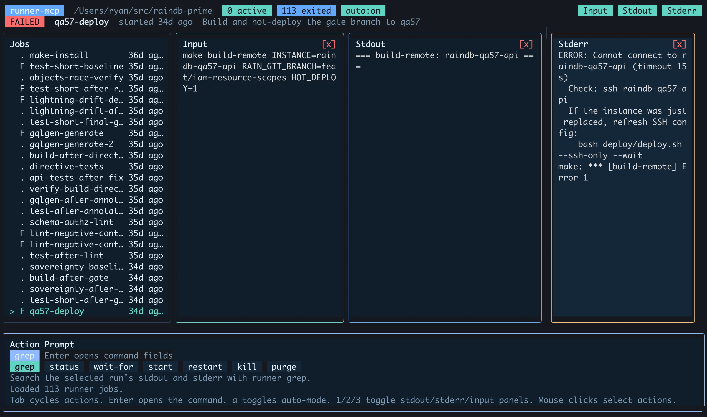
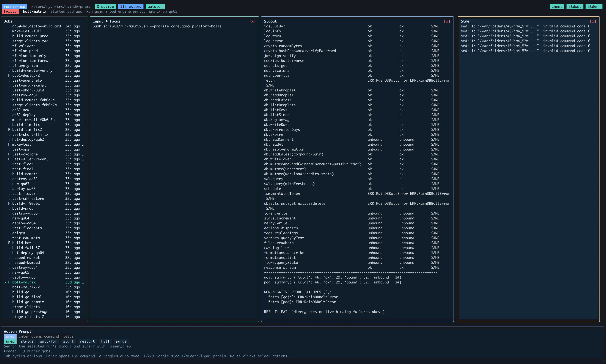
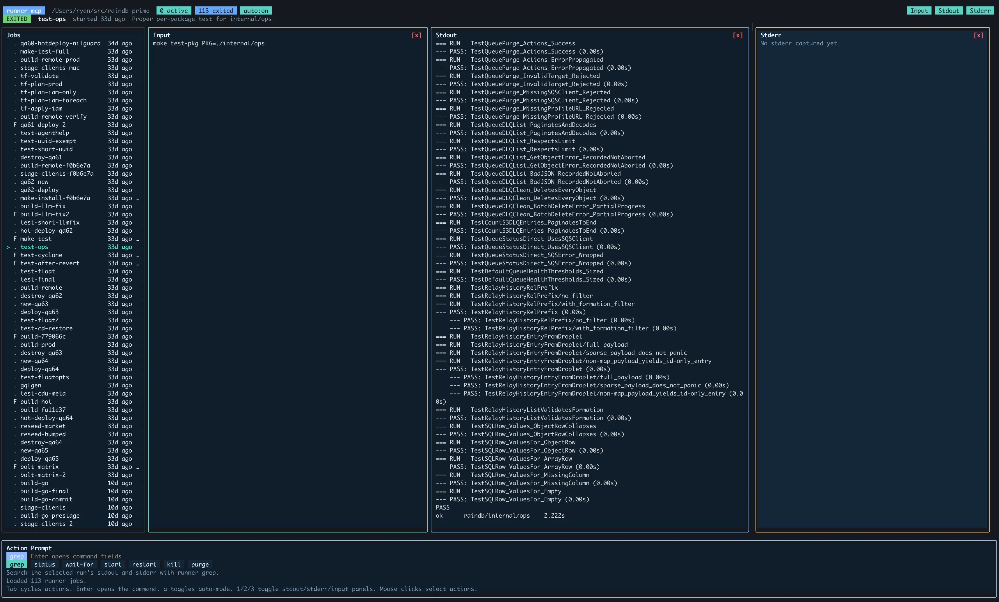

# runner-mcp

A powerful run tool for AI agents providing perfect execution and visibility
into commands the agent runs providing job tracking (runId) and background detachment
to never timeout, continuing execution for critical tasks even when stopping the agent
or even exiting the session.  Extremely valuable for standard workflows for
development (npm run dev/vita start), builds or tests (go test, pytest),
critical database migrations, terraform deployments, ssh remote commands, etc.
AI agents love `runner` allowing execution of commands capturing the full output
providing the information the agent needs without filling up the context and able
to grep the output and review the full content without having to re-run the same command
because the output was swallowed by |grep|head|tail commands. 

Agents love `runner` because it captures the complete stdout and stderr, 
protecting the session context from massive data returning contextually 
important details such as, failures, exit code, detected URLs and ports 
allowing an agent to grep, relay, or drill into any section of the output.
This breaks the pattern of agents running the same command repeatedly over 
and over with different grep patterns to get different results, messing up the escaping
of the complex bash command with poor attempts to do what runner does automatically.

A companion TUI, **`runner-cli`**, lets the operator watch, review, 
and kill every operation providing extremely valuable visibility.

Every process is **detached into the background** keeping active jobs
running when you interrupt the agent, restart or quit the session. The
dev server, deployment, build, or long task remains running uninterrupted. 

`runner` provides multi-turn sub-agent operations (opencode, Claude Code, Codex, or Grok) 
allowing the agent to act as lead engineer overseeing an implementation, 
**multi-turn peer-review or collaboration** or single one-n-done tasks as well. 

Works with **opencode, Claude Code, Codex, Grok, and VS Code / Cursor** on
**macOS and Linux**.

## TUI interface (`runner-cli`)

`runner-cli` is an interactive TUI getting visibility into the processes
currently running, failed, and successful, full command input+parameters, 
stdout/stderr logs, and the same mcp tools the agent has to restart tasks 
and kill jobs.

```sh
runner-cli
```

- **Job list** with per-run state (running / exited), result, and age.
- **Input / Stdout / Stderr panels** showing the command and its full
  captured output (auto-refreshing for live runs).
- **Actions** on the selected run: `grep`, `status`, `wait-for`, `start`,
  `restart`, `kill`, `purge` just like the agent can do.
- **Keys:** `1` / `2` / `3` toggle the stdout / stderr / input panels,
  `Tab` cycles actions, `a` toggles auto-refresh, `Enter` opens the
  selected action, mouse clicks select.
- **Data Location** stored in the `<git-root>/.runner/` idempotently
  added to `git/info/exclude` to be automatically ignored by git.

<p align="center">
  <br>
  <em>The run list with a failed job selected, stdout/stderr captured.</em>
</p>

<p align="center">
  <br>
  <em>Input, Stdout, and Stderr panels side by side -- full captured output, no log-grepping.</em>
</p>

<p align="center">
  <br>
  <em>A successful run with its complete output captured and replayable.</em>
</p>

## Why it's different

- **Full capture, compact responses.** The complete stdout/stderr captured;
  each call returns decision-first JSON (`state`, `result`, `exitCode`,
  `endpoints`, `warnings`, `stdoutTail`) surfacing only relevant information
  to the agent so that a long or noisy job never blows out the context window.
- **Background detachment.** Runs detach at spawn providing perfect development
  workflow so critical tasks are not mistakenly interrupted.  
- **Replay, grep, summarize.** Reopen any run by `runId` to replay output,
  regex-search it, or read a structured summary.
- **Structured test results.** `go test` and `pytest` are auto-parsed into
  a failure-first `testSummary`: green collapses to counts, red inlines
  each failure with a pointer to the full log.
- **Kill / restart control.** Address a run by id to `restart` under the
  same id or `kill` its whole process group -- never a duplicate service.
- **Agent collaboration.** Delegate to a peer agent and hold a multi-turn
  conversation establishing collaborator sub-agent that keeps context.
- **Session Continuation.** Providing your agent an opencode or claude sessionId
  will allow the agent to continue that session as a sub-agent for a multi-turn
  conversation. Useful for providing an agent a session that already has
  full context of a task it needs to complete, input or collaboration.   
- **Timeout-proof.** A blocking run returns `stillRunning` and the agent
  polls until done. Long commands never trip the MCP transport timeout,
  and the job is never killed by the wait.
- **NOTE:** Sometimes when the operator interrupts the agent waiting for a
  runner job to complete opencode may report that a job was terminated, the
  agent **should** depend on the runner list and job status ignoring the notice
  but to be sure remind the agent to use runner list or status to confirm the status.

## Helpful Input commands to tell the agent

- use runner guide to know how to run commands
- start the client and server using runner
- restart the client and server with runner
- use runner to collaborate with opencode (or claude/codex/grok) to implement the plan acting as lead engineer reviewing the work and surfacing any problems or issues to me to review and discuss next steps.
- tell the agent that it needs to stop what it's doing and report the current status and wait for next operation

---

## Install

```sh
curl -fsSL https://github.com/gignit/runner-mcp/releases/latest/download/install.sh | sh
```

That one line is the supported install method. The installer:

1. Detects your OS + architecture (macOS/Linux, amd64/arm64) and downloads
   the matching release tarball from GitHub Releases (checksum-verified).
2. Installs the payload to `$XDG_DATA_HOME/runner-mcp`
   (default `~/.local/share/runner-mcp`).
3. Symlinks the `runner-cli` and `runnerlog` CLIs into `~/.local/bin`.
4. Registers the MCP server with every supported agent it finds on your
   machine: **opencode**, **Claude Code**, **Codex**, **Grok**, and
   **VS Code / Cursor** (via each one's user `mcp.json`).

**Requirements at runtime:** `node` and `python3` on your `PATH`
(both are typically already present for agent users).

To pin a specific version:

```sh
curl -fsSL https://github.com/gignit/runner-mcp/releases/download/v0.1.0/install.sh | sh
```

After installing, **restart your agent** so it loads the MCP server. Each
tool's description is self-sufficient -- the agent doesn't need to call
`runner_guide` first.

### Uninstall

```sh
# See what would be removed (removes nothing):
curl -fsSL https://github.com/gignit/runner-mcp/releases/latest/download/install.sh | sh -s -- --uninstall

# Actually uninstall:
curl -fsSL https://github.com/gignit/runner-mcp/releases/latest/download/install.sh | sh -s -- --uninstall --yes
```

It removes exactly what was installed: the payload dir
(`~/.local/share/runner-mcp`), the `runner-cli` / `runnerlog` symlinks (only
if they still point into that dir), and the `runner` MCP registration from
every agent (opencode, Claude, Codex, Grok, VS Code / Cursor). **Per-project `<git-root>/.runner/`
run data is never touched** -- so uninstalling and reinstalling a new version
is clean and safe.

### Per-project isolation

Run data is stored in `<git-root>/.runner/` for whatever project the agent
is working in, so each project's agents only see that project's runs. The
runner adds `.runner` to the project's `.git/info/exclude` automatically, so
it never shows up in `git status`. (When invoked outside any git repo, runs
fall back to `~/.local/share/runner-mcp`.)

### Building from source

```sh
make build      # compile for this machine (mcp/dist + bin/runner-cli)
make install    # build, stage a local tarball, run install.sh against it
make release    # cross-compile all targets + publish a GitHub Release
```

---

## AGENT INSTRUCTIONS

Use the `runner guide` to learn how to use runner (full text in
`docs/GUIDE.md`) is the deeper reference. The core workflows:

### 1. Client / server dev loop (background services)

Start the frontend and backend as detached services, wait for each to
signal ready, then restart on change:

```
runner_start { cmd: "npm run dev", name: "fe", blocking: false, cwd: "client" }
-> { runId, pid, ... }                                    (returns immediately)
runner_wait_for { runId, pattern: "ready in" }
-> { outcome: "matched", endpoints: ["http://localhost:5801/"] }

runner_start { cmd: "go run ./server", name: "api", blocking: false }
runner_wait_for { runId, pattern: "listening" }

runner_restart { runId }        # refresh after a code change
runner_kill    { runId }        # stop
```

**Two rules that matter:**
- **Never `runner_start` the same service twice** -- `runner_restart`
  refreshes it under the same `runId`. Lost the id? `runner_list { state:
  "running", name: "fe" }`.
- **`runner_status` is the only source of truth.** A `runner_wait_for`
  `matched`/`timeout`/aborted result says nothing authoritative about the
  run -- the process is detached and is never killed by a wait. `matched`
  just means the pattern appeared. For real `state`/`result`/`exitCode`,
  call `runner_status { runId }`.

### 2. One-shot builds, tests, installs (default)

```
runner_start { cmd: "go test ./...", cwd: "/path/to/project" }
runner_start { cmd: "pytest", cwd: "/path/to/project" }
runner_start { cmd: "npm run build" }
```

`blocking: true` (default) holds the response until the run is terminal;
if it's still running when the wait window elapses, you get
`stillRunning: true` and just call `runner_status { runId }` until
`terminal: true`. No sleeps, no timing decisions. The terminal response
carries `result`, `exitCode`, `stdoutTail`, `warnings` (ERROR/FAIL/panic
lines even when exit code is 0), and `endpoints`.

**`go test` and `pytest` are auto-parsed** into a normalized,
failure-first `testSummary` (same shape for both; only `framework`
differs). Green collapses to counts; red inlines each failing test's
assertion detail with a `logRef` and ready-to-run `runner_section`
`nextCalls`:

```json
"testSummary": {
  "framework": "go-test",
  "status": "failed",
  "packages": { "run": 5, "passed": 4, "failed": 1 },
  "tests": { "passed": 89, "failed": 1, "skipped": 0 },
  "failures": [
    { "package": "example/pkg/store", "test": "TestEtag",
      "detail": ["store_test.go:42: want 200, got 500"],
      "logRef": { "section": "example/pkg/store", "fromLine": 40, "toLine": 55 } }
  ],
  "nextCalls": [
    { "tool": "runner_section",
      "args": { "runId": "...", "name": "example/pkg/store" } }
  ]
}
```

The raw per-package stream is suppressed for adapter runs (a 200-test run
returns a handful of events, not 200); `verbose: true` or `runner_section`
restores it. Field set evolves -- the tool descriptions and `runner_guide`
are the source of truth.

### 3. Instrumented scripts (optional)

If you write a script yourself, you can emit explicit
`section_start` / `section_end` / `metric` / `event` / `fail` markers
through the `runnerlog` helpers (bash sourceable, python module + CLI
shim) -- giving the runner explicit structure rather than relying on
output adapters.

```bash
source "${XDG_DATA_HOME:-$HOME/.local/share}/runner-mcp/lib/runnerlog.sh"
runnerlog_section_start build
go build ./...
runnerlog_section_end build ok exit=$?
```

You **never** write `::run::` protocol lines by hand. Always go
through a helper.

### 4. Agent collaboration (multi-turn)

Delegate a self-contained task to a peer agent and hold a real
conversation with it across turns -- it keeps context between messages,
so it's a true collaborator rather than a single-use prompt.

```
# Start a conversation (returns a runId for the sub-agent run):
research_and_code_assistant_agent { ask: "Audit src/auth for missing input validation and report findings." }
-> { runId, ... }

# Continue the SAME conversation -- the sub-agent still remembers turn 1:
research_and_code_assistant_agent { runId, ask: "Now fix the two highest-severity issues you found and run the tests." }

# Fire-and-forget while you do other work, then poll for the reply:
research_and_code_assistant_agent { ask: "...", blocking: false } -> { runId, stillRunning: true }
research_and_code_assistant_agent { runId }   # poll: returns the reply when ready

# Choose the backend with `agent` (default: opencode):
research_and_code_assistant_agent { ask: "...", agent: "claude" }
research_and_code_assistant_agent { ask: "...", agent: "codex" }
```

The sub-agent runs in the **same project** with the same file access, so
it can read, edit, build, and test alongside you.

**What comes back.** A finished call returns `finalReply.text` -- the
sub-agent's complete reply for that turn (not a transcript dump) -- plus
an `agent` block (`runtime`, `turn` count, tokens, `lastReason`) and a
`transcriptHint` pointing at the full log for drill-down. If the turn is
still running you get `stillRunning`; poll with `runId` alone to collect
the reply. `runner_list` surfaces each conversation's `agent` block and
flags a wedged turn as `stalled: true`.

**Backends.** `agent: "opencode"` (default), `"claude"`, or `"codex"`,
chosen when the conversation starts; later turns stay on that backend.
Each must be installed and authenticated. Model overrides use each
backend's own naming (`provider/model` for opencode, an alias/id for
claude, a slug for codex); `listModels: true` lists what each accepts.
Sessions started outside runner can be adopted -- opencode `ses_...` ids
and Claude/Codex UUIDs, including from another project (resumed in their
original cwd).

Sub-agents run unattended with the same file access as you, so **only use
these backends in workspaces you trust.**

---

## Tools

| Tool | Purpose |
|------|---------|
| `runner_guide` | Optional deeper reference. Each other tool's description is self-sufficient; reach for the guide when a response field needs context (e.g. unfamiliar `testSummary`, `suppressedTestEvents`, `warnings`, `stillRunning`). |
| `runner_helpers` | Paths to the bash/python/CLI helpers + ready-to-paste snippets. Use when WRITING an instrumented script. |
| `runner_start` | Spawn a command (runs it exactly, never rewritten). `blocking: true` (default) holds until terminal, else returns `stillRunning: true`. `blocking: false` for services. Gates filter pipes + multi-step chains: names the operator and returns the exact per-step split (or the script workflow); `noScrub: true` bypasses. Auto-detects known output formats. |
| `runner_restart` | Kill + respawn under the SAME runId. Use this for services -- never `runner_start` twice. |
| `runner_wait_for` | Block until a regex matches in stdout/stderr (or the run exits, or the wait window elapses). Use after a non-blocking start to wait for the service ready signal. Returns `matched` / `exited` / `timeout` -- **none of which is authoritative about the run** (see below); poll `runner_status` for the real state. |
| `runner_status` | Delta-aware status. **Auto-waits for blocking-mode runs** so the agent's protocol is just "call until terminal:true". Returns immediately for services. Surfaces `testSummary`, `endpoints`, `restartCount`, `warnings`, `stdoutTail`. Optional embedded grep. |
| `runner_section` | Drill into one section's structured detail. For go-test runs each section is a package; passing tests are filtered by default (verbose:true to see all). |
| `runner_grep` | Regex search over `stdout.log` + `stderr.log` with line numbers and `-A`/`-B` context. |
| `runner_list` | Scoreboard of all runs (global runId index). Each entry: `state`, `lastLine`, `lastLineAgeSec`, `restartCount`, `stderrCount`, `endpoints`. Filters: `state`, `name` (regex/substring). |
| `runner_kill` | SIGKILL the run's process group. |
| `runner_purge` | Remove run directories with a structured report. No args = all terminal runs in your project root. `result: "success"`/`"failed"` filters by outcome. `olderThan: N` filters by age. `runId` removes one. Active runs are never purged and are reported in `kept.active`. |
| `research_and_code_assistant_agent` | Delegate to a peer agent and hold a multi-turn conversation. `ask` (new conversation) -> `runId`; pass `runId` + `ask` to continue the same conversation; pass `runId` alone to poll for the reply. `blocking: false` to dispatch in the background. Runs in the same project with the same file access. `agent: "opencode"` (default), `"claude"`, or `"codex"` picks the backend. |

---

## How it works (architecture)

The installer lays the payload down in the XDG data dir
(`$XDG_DATA_HOME/runner-mcp`, default `~/.local/share/runner-mcp`):

```
~/.local/share/runner-mcp/
  core/runner_core.py    # everything: CLI + library + adapters
  lib/runnerlog          # author-facing CLI shim (Python)
  lib/runnerlog.sh       # bash sourceable helpers
  lib/runnerlog.py       # python module (function API + context manager)
  mcp/dist/index.js      # MCP server (stdio transport, TypeScript -> JS)
  docs/GUIDE.md          # agent-facing guide (served by runner_guide)
  LICENSE                # AGPL-3.0-or-later
  index.jsonl            # global runId -> runDir registry (no-git-repo runs)
```

The CLIs (`runner-cli`, `runnerlog`) are symlinked into `~/.local/bin`.

### Spawn model and storage scoping

`runner_start` does a double-fork-and-setsid so the spawned process
detaches from the runner CLI and survives. PID, stdout, stderr, and
metadata go to a per-run directory.

**Storage is scoped to the AGENT'S project root**, not to the cmd's
working directory:

- If the agent's session cwd is inside a git repo, runs are stored at
  `<agent-git-root>/.runner/<runId>/`. ALL runs an agent starts -- even
  ones whose cmd targets a different project -- land here.
- Otherwise (no git root), runs go to `~/.local/share/runner-mcp/<runId>/`.

This is deliberate isolation: an agent in project A only sees its own
runs in `runner_list`, never runs that another agent in project B
started in parallel. Two agents working in the same project root WILL
see each other's runs (assumed coordinated by the engineer). The
`cwd` parameter on `runner_start` sets the SPAWN working directory for
the cmd (and may point at any path) -- it does NOT change where the
run is stored.

Run dirs are auto-excluded from the host project's `git status` via
`.git/info/exclude` (local-only -- never touches the project's
tracked `.gitignore`). The exclude entry is added the first time the
runner spawns a run inside a given git repo, then never re-added.

Each run dir contains:
- `meta.json` -- cmd (exactly as given), parser,
  cwd, pid, start/end times, exit code, state, restartCount,
  blockingMode
- `stdout.log` -- raw stdout (parsed on demand for `::run::`
  markers AND fed through registered output adapters)
- `stderr.log` -- raw stderr
- `tracker.json` -- per-agent delta cursors

### MCP server

`mcp/src/index.ts` is a thin TypeScript stdio MCP server that
translates each MCP tool call into a `runner_core.py` subcommand
invocation and returns the JSON response verbatim. There's no state
in the MCP server itself -- everything lives in the run dirs and
the global index.

### Guide is optional

`runner_guide` returns the markdown guide on demand but is not gated
on. Each other tool's description is written to be self-sufficient --
explaining its semantics, response shape, and which other tools to
chain with -- so an agent can use any tool cold. The guide is for
deeper reference when a response field surprises the agent or a more
complex workflow needs context.

### Output adapters

When stdout has no `::run::` markers in the first ~60 lines, registered
output adapters get a chance to recognize the format. **`go-test` and
`pytest` adapters ship today**, both producing the same normalized
`testSummary`; the architecture is open for more (`jest`, `cargo test`,
etc.). An adapter sniffs early lines, then synthesizes
`section_start` / `event` / `metric` / `section_end` events for the
rest of the system to consume. `runner_status.parserUsed`
tells the agent which adapter (if any) built the structure.

### Command gating (safety + correct usage)

`runner_start` **runs your command exactly or not at all -- it never
rewrites it.** Before spawning, it inspects the cmd (without modifying it)
and gates two patterns, returning an instructional message instead of
executing:

1. **Filter/pager pipes** (`| grep`, `| tail`, `| head`, ...) -- redundant
   (the runner already captures everything; use `runner_grep` /
   `runner_section` / `stdoutTail`) and they hide output from the adapters.
2. **Multi-step chains** (`&&` / `||` / `;`) -- the gate names the operator
   and returns the exact per-step split or the `.runner/scripts/` workflow.

Why gate instead of silently rewriting? Executing a rewritten command is
unsafe -- a mis-parse could turn a benign command into a destructive one
you never wrote. The runner refuses to alter a command; `noScrub: true`
bypasses the gate and runs the exact string verbatim (e.g. a `cd x &&
./run` that must share shell state).

### `.runner/scripts/` -- the home for multi-step runner scripts

For anything beyond a single producer command, write a small script in your
project's `.runner/scripts/` directory and run that. This directory:

- is **already git-excluded** (it's under `.runner/`), so scripts never
  show up as project noise;
- lives next to your run data, so scripts are easy to find, copy, reuse,
  and enhance;
- is the **productive alternative to escaping a compound one-liner** -- you
  write normal shell, and with the `runnerlog` helpers each step reports
  structured status (`section_start` / `section_end` / `metric` / `event`),
  which the runner surfaces as `failedSections`, per-section timing, and
  metrics.

Call `runner_helpers` for ready-to-paste bash/python/CLI instrumentation
snippets and the exact paths, then:

```sh
runner_start { cmd: "bash .runner/scripts/task.sh" }
```

### Endpoint detection

After every run completes (or whenever `runner_status` / `runner_list`
runs), the first ~200 lines of stdout+stderr are scanned for service-up
patterns -- vite "Local: http://...", go "listening on :PORT" / `addr:
":PORT"`, express "Server running on port N", uvicorn "Uvicorn running
on http://...", rails "Listening on http://...". Detected URLs/ports
are surfaced in `endpoints` so the agent never has to grep "what port
is this on?".

### Warning detection

After every terminal run, stdout+stderr are scanned (last 1 MB each,
bounded) for `ERROR` / `FAIL` / `panic:` / `fatal` / `Traceback ` /
`connection refused` patterns. If any match, the response includes:

```json
"warnings": {
  "count": 6,
  "sample": [{ "stream": "stdout", "lineNo": 91, "line": "ERROR: ..." }],
  "hint": "Output contains ERROR / FAIL / panic / fatal lines even though exit code may be 0..."
}
```

This catches the common case where a script (e.g. `make reinstall`
with optional seeding) reports `exitCode: 0` while individual steps
logged real errors.

---

## Troubleshooting

| Symptom | Cause / fix |
|---------|-------------|
| Agent loses runId, starts duplicate services | Use `runner_list { state: "running", name: "..." }` to find runs. Use `runner_restart` (not `runner_start`) to refresh. |
| MCP transport timeout on `runner_start` | Should not happen: the blocking wait (`BLOCKING_WAIT_SEC`) is sized to return `stillRunning` before the transport gives up. If it ever does, the run is still alive -- call `runner_status { runId }` with the id you got back. |
| `result: "success"` but build broke | Check `warnings` field. Many shell scripts exit 0 while logging errors. |
| `runner-cli` / `runnerlog: command not found` | `~/.local/bin` not on `$PATH`. Add `export PATH="$HOME/.local/bin:$PATH"` to your shell rc. |
| Installer says `node` / `python3` missing | Install Node and Python 3, then re-run the installer. Both are runtime requirements. |
| Agent doesn't auto-register | The installer auto-registers with opencode/Claude/Codex/Grok/VS Code only if their config/CLI is present. opencode and VS Code auto-registration also need `jq`. |

---

## Layout (source)

```
runner-mcp/
  install.sh                # the installer (curl | sh)
  Makefile                  # build / install / release
  VERSION                   # single source of truth for the version
  LICENSE                   # AGPL-3.0-or-later
  README.md                 # this file
  core/
    runner_core.py          # core implementation: CLI, adapters, library
  lib/
    runnerlog               # author-facing CLI shim (Python)
    runnerlog.sh            # bash sourceable helpers
    runnerlog.py            # python module + context manager
  mcp/
    src/index.ts            # MCP server (stdio transport)
    package.json
    tsconfig.json
  docs/
    GUIDE.md                # agent-facing guide (served by runner_guide)
  tui/
    main.go                 # runner-cli TUI (live run dashboard)
```

---

## Conventions

- Agents address runs by `runId` only -- the global
  `~/.local/share/runner-mcp/index.jsonl` resolves any runId to its run
  dir, so `cwd` is **not** required on follow-up tool calls.
- Service runs should be given a memorable `name` (e.g. `"fe"`,
  `"api"`) so they're easy to find with `runner_list`.
- Filter pipes (`| head`, `| tail`, `| grep`, etc.) belong to the
  runner, not to the spawned cmd. Use `runner_grep` / `runner_section`
  / the auto `stdoutTail` instead.
- Test commands should NOT shell out and grep -- the go-test adapter
  surfaces failures structurally.

---

## License

[GNU AGPLv3](LICENSE).
